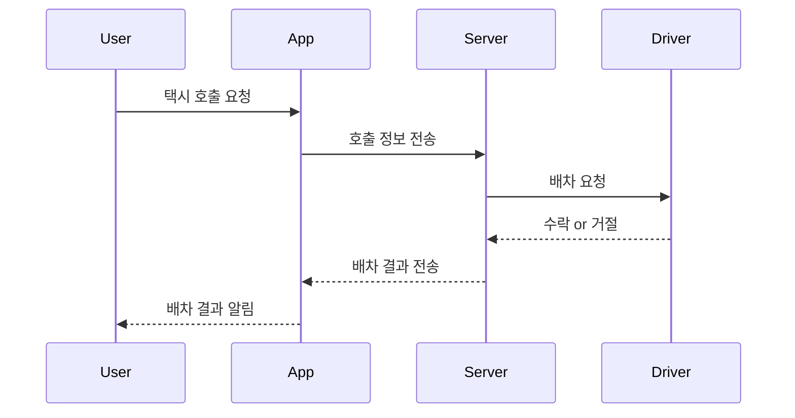

# 🚖 카카오택시 호출 시퀀스 다이어그램 및 샘플 구현

## 📌 프로젝트 개요
일상 속 소프트웨어 사용 사례 중 하나인 "택시 호출 앱"을 주제로, 사용자가 호출을 요청하고 서버를 통해 기사가 배정되는 과정을 시퀀스 다이어그램과 JavaScript 코드로 구현하였습니다.

## 🔁 시퀀스 다이어그램



(→ diagram.mmd 파일로도 제공됩니다)

## 💻 샘플 코드 (TaxiApp.js)
사용자가 앱에서 택시를 호출하면 서버가 배차 결과를 전달하는 시뮬레이션 코드입니다.

## 🧪 모듈 평가
응집도와 결합도 평가 내용은 `module-eval.md` 파일을 참조해주세요.

## ✅ 실행 방법
Node.js 환경에서 아래 명령어로 실행:

```bash
node TaxiApp.js
```
