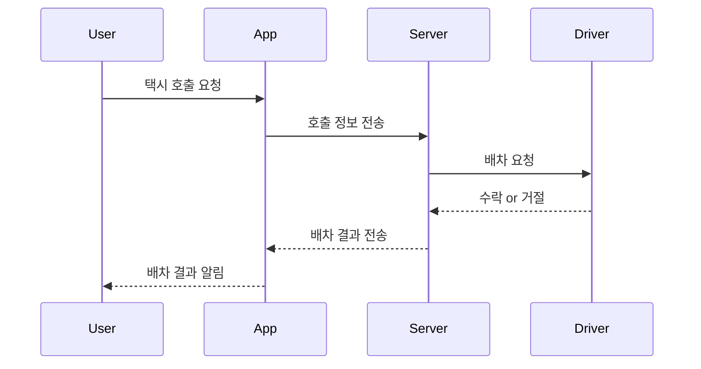

# 🚖 카카오택시 호출 시퀀스 다이어그램 및 샘플 구현

## 📌 프로젝트 개요
일상 속 소프트웨어 사용 사례 중 하나인 "택시 호출 앱"을 주제로, 사용자가 호출을 요청하고 서버를 통해 기사가 배정되는 과정을 시퀀스 다이어그램과 JavaScript 및 Python 모듈로 시뮬레이션 구현하였습니다.

---

## 🔁 시퀀스 다이어그램



📁 다이어그램 원본: `sequence/diagram.mmd`

---

## 💻 샘플 코드 (TaxiApp.js)
사용자가 앱에서 택시를 호출하면 서버가 배차 결과를 전달하는 JavaScript 기반 시뮬레이션 코드입니다.  
Node.js 환경에서 실행 가능합니다.

```bash
node TaxiApp.js
```

---

## 🧩 시스템 구성 모듈 (Python)

아래 Python 모듈들은 카카오택시 호출 시스템을 구성하는 주요 기능들을 시뮬레이션한 예시입니다:

| 모듈 이름 | 설명 |
|-----------|------|
| `auth.py` | 사용자 로그인 기능 (ID/PW 기반) |
| `location.py` | 사용자 GPS 위치 정보 시뮬레이션 |
| `dispatch.py` | 기사 거리 기반 자동 배차 알고리즘 |
| `status.py` | 호출 → 배차 → 운행 상태 흐름 관리 |
| `fare.py` | 거리/시간 기준 요금 계산 |
| `payment.py` | 카드 결제 시뮬레이션 |
| `driver.py` | 기사 정보 (이름, 차량번호, 평점 등) |
| `review.py` | 이용자 후기 및 평점 기록 기능 |
| `notification.py` | 실시간 알림 메시지 발송 기능 |
| `admin.py` | 관리자 호출 로그 관리 기능 |

📁 모듈 경로: `app/*.py`

---

## 🧪 모듈 평가
모듈 구조는 SRP(Single Responsibility Principle)를 기반으로 설계되어, 각 기능이 독립적이고 응집도 높으며 결합도는 낮도록 구성되어 있습니다.  
자세한 내용은 `evaluation/module-eval.md` 파일을 참조해주세요.

---

## ✅ 실행 방법

### JavaScript 기반 호출 시뮬레이션
```bash
node TaxiApp.js
```

### Python 모듈 실행 예시
```python
# Python 콘솔 또는 파일에서 예시 실행
from app import auth, dispatch, payment

auth.login("user1", "pass123")
dispatch.dispatch(3, [{"id":1,"location":2}, {"id":2,"location":5}])
payment.process_payment(101, "1234-5678-9876-5432")
```

---

## 📄 라이선스
본 프로젝트는 소프트웨어공학 곽상헌 개인 과제로 개발된 시뮬레이션 프로젝트입니다.
